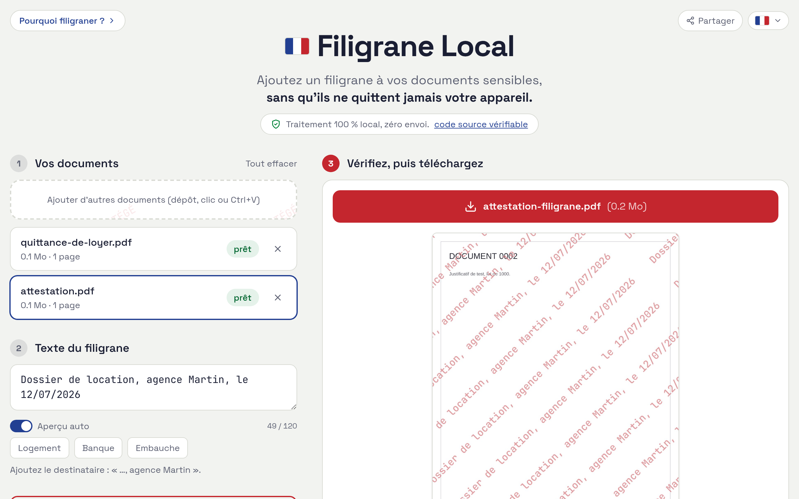

# Filigrane Local

Ajoute un filigrane à vos PDF et images, 100 % localement. Aucun envoi : il n'y a pas de serveur.

**[filigrane-local.fr](https://filigrane-local.fr)**



## Auto-hébergement

Aucune raison de faire confiance à mon déploiement. Le site est un export statique, hébergez-le vous-même.

Prérequis : [Bun](https://bun.sh).

```sh
git clone https://github.com/KazeTachinuu/filigrane-local
cd filigrane-local
bun install
bun run build      # export statique dans out/
bunx serve out     # ou n'importe quel serveur de fichiers statiques
```

`out/` se dépose tel quel sur n'importe quel hébergeur statique, ou dans un dossier local.

## Développement

```sh
bun run dev        # serveur de développement
bun test           # tests unitaires
bun run test:e2e   # suite navigateur
```

Next.js (export statique), React, Tailwind, PDF.js, pdf-lib.

## Licence

AGPL-3.0. Inspiré de [Filigraneur](https://github.com/cyberclarence/filigraneur) (CyberClarence), réécrit par KazeTachinuu.
